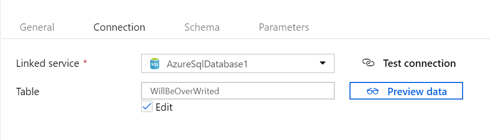
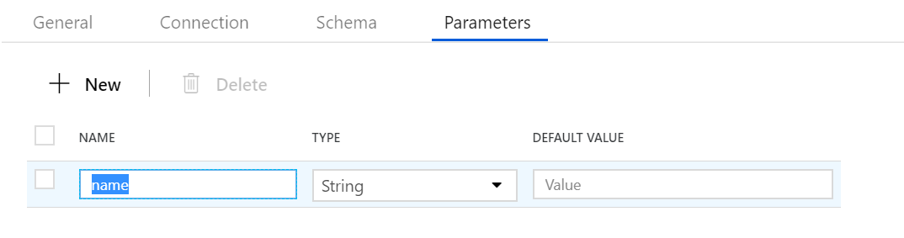
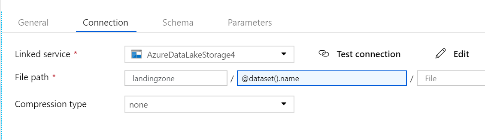
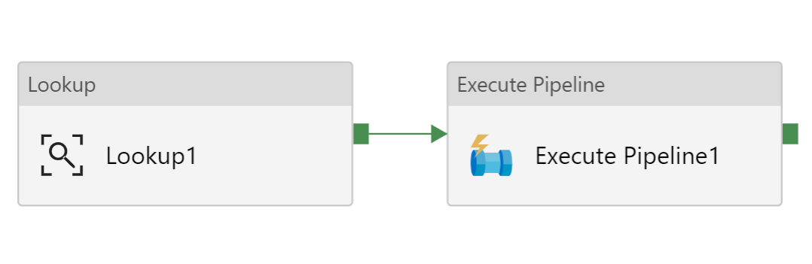
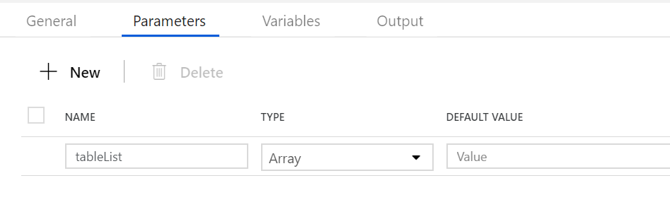
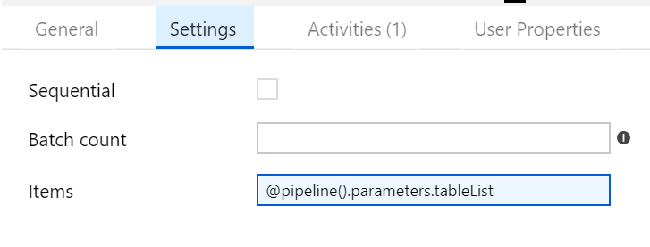
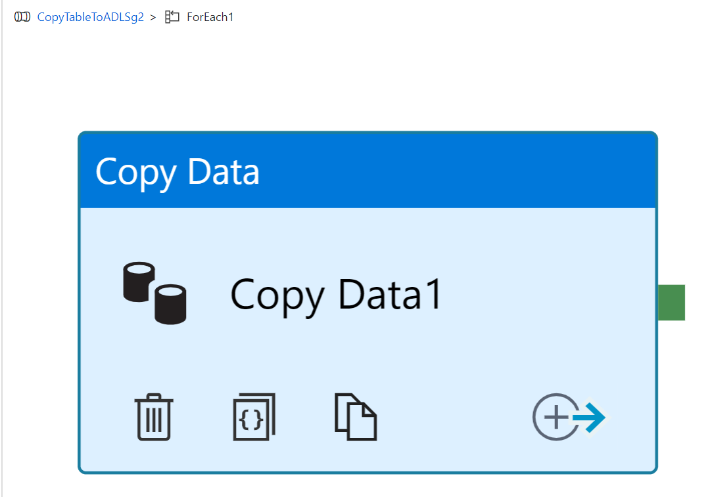
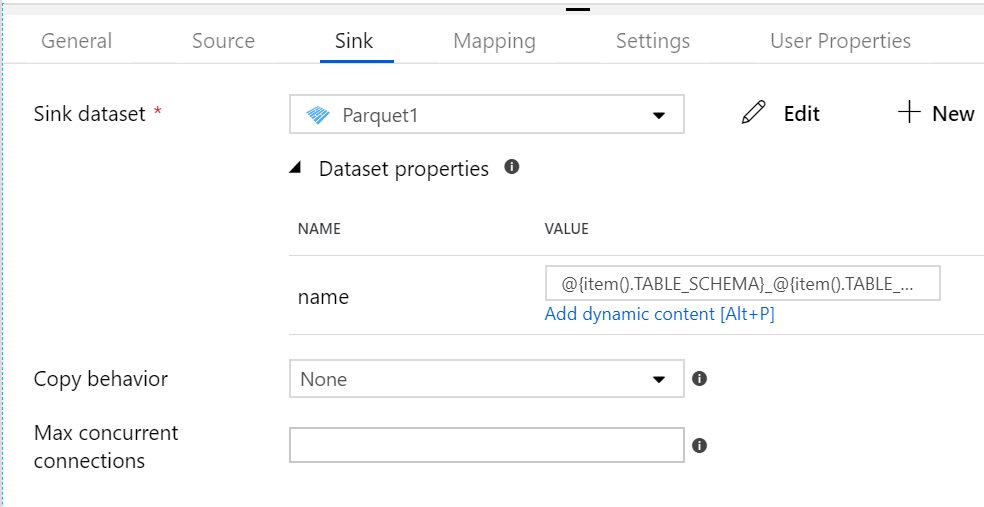
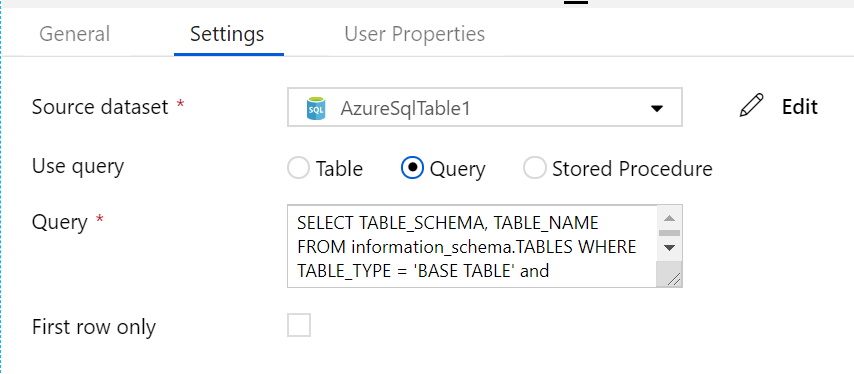
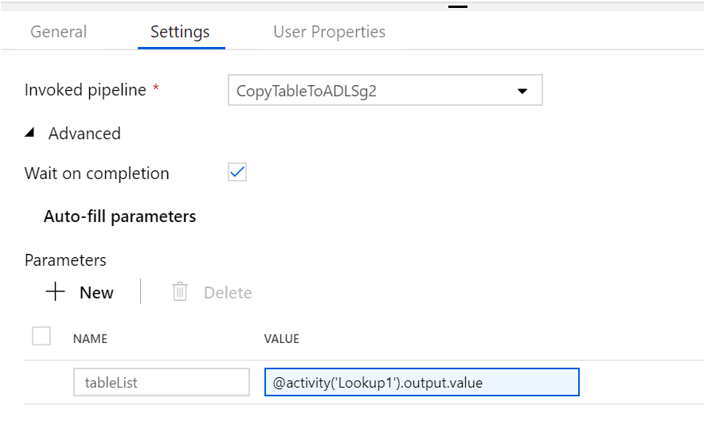

# Azure Data Factory

## Copy data in bulk

Copy multiple tables from SQL Database to ADLS gen 2

Use two pipelines

First pipeline will look up SQL DB to get table list and then second pipeline will use the name of the tables to select and copy to ADSL gen 2


### Create Azure Data Factory

### Create Linked Servcies

#### Create Linked Service for Source

SQL Database is source

|Key|Value|
|-|-|
|Server Name|```azlab0sql.database.windows.net```|
|Database Name|```azlab0db```|
|Authentication Type|SQL Authentication|
|User Name|```sqladmin```|
|Password|```_password_```|

#### Create Linked Service for Sink (destination)

Azure Data Lake Storage Gen 2 is destination

### Create Datasets

#### Create Dataset for Source

Create Azure SQL Database for source dataset

Check on edit checkbox and use any randomn table name

> The Table name will be over writen by Copy Activity later



#### Create Dataset for Sink (destination)

Create _Parquet_ for destination dataset

Add Paramter



Use ```landingzone``` as file path and ```@dataset().name``` as 



### Create Pipeline

Create two pipeline like following



First create copy pipeline and then create second pipleine for lookup

#### Create Copy Pipeline

Create pipeline and name it as ```CopyTableToADLSg2``` 

Add parameter at pipeline level, name it ```tableList``` and choose type as _Array_

> This _tableList_ name will be used to get table name from another pipeline activity



Drag and drop _ForEach_ activity on canvas

Select the _ForEach_ activity and go to _Settings_ 



Double click the _ForEach_ Activity

Drag and drop Copy Data activity 



Go to _Source_ tab and use following query 

```sql
SELECT * FROM [@{item().TABLE_SCHEMA}].[@{item().TABLE_NAME}]
```

Go to _Sink_ tab 

Select _Parqeut_ for _sink dataset_ use following value

```text
@{item().TABLE_SCHEMA}_@{item().TABLE_NAME}
```



#### Create Lookup Pipeline

Create a pipeline and name it as ```GetTableList```

Drag and drop Lookup activity

Go to _Settings_ and select _Query_ and use following query to run

```sql
SELECT TABLE_SCHEMA, TABLE_NAME FROM information_schema.TABLES WHERE TABLE_TYPE = 'BASE TABLE' and TABLE_SCHEMA = 'SalesLT' and TABLE_NAME <> 'ProductModel'
```


Drag and drop _Execute Pipeline_

Select _CopyTableToADLSg2_ for invoked pipeline

Add a parameter ```tableList``` and use following value 

```@activity('Lookup1').output.value```



### Run a Pipeline

### Monitor the Pipeline Run

---
Ref: https://docs.microsoft.com/en-us/azure/data-factory/tutorial-bulk-copy-portal