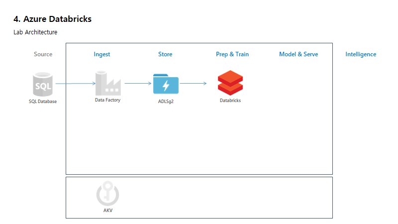

# 4. Azure Databricks

Scenario Architecture



## 4.1 Create ADB Workspace

## 4.2 Create Cluster

## 4.3 Import Notebooks

```https://github.com/xlegend1024/azlab-flightdelay-01/blob/master/4.ADB/FlightDelay-01.dbc```

## 4.4 Read data from Eventhub

### 4.4.1 Read Events

### 4.4.2 Save Data

## 4.5 Read data from CosmosDB

### 4.5.1 Read Data

### 4.5.2 Save Data

## 4.6. Mount ADSL gen 2

### 4.6.1 Read Files

### 4.6.2 Join Data

### 4.6.3 Save Data